# Antifragile Strategy Presentation

This directory contains a Marp-based presentation with Mermaid diagram support.

## Files

- `presentation.md` - Main presentation file
- `diagrams.md` - Mermaid diagram definitions
- `diagrams/` - Directory containing SVG diagram files
- `slides/` - Generated HTML presentation output
- `Makefile` - Build automation
- `package.json` - Node.js dependencies

## Usage

### Basic Commands

```bash
# Install dependencies and build everything
make

# Just generate HTML presentation
make html

# Set up diagram directory structure
make diagrams

# Watch mode for live editing
make watch

# Serve presentation locally
make serve

# Clean build artifacts
make clean
```

### Adding Diagrams

1. **Define diagrams** in `diagrams.md` using Mermaid syntax:
   ```markdown
   ```mermaid
   flowchart TD
       A[Start] --> B[Process]
       B --> C[End]
   ```
   ```

2. **Generate SVG files** using one of these methods:

   **Option A: Mermaid Live Editor (Recommended)**
   - Go to https://mermaid.live/
   - Paste your Mermaid code
   - Export as SVG
   - Save to `diagrams/diagram1.svg`, `diagrams/diagram2.svg`, etc.

   **Option B: Mermaid CLI (if browser available)**
   ```bash
   npx @mermaid-js/mermaid-cli -i diagram.mmd -o diagram.svg --theme dark
   ```

3. **Include in presentation** by adding image references in `presentation.md`:
   ```markdown
   
   ```

### Diagram Naming Convention

- Use descriptive names: `lost-in-translation.svg`, `workflow-architecture.svg`
- Or use numbered sequence: `diagram1.svg`, `diagram2.svg`, etc.
- Keep SVG files in the `diagrams/` directory

### Styling

The presentation uses a custom theme with:
- **Background**: Midnight blue (`#001f3f`)
- **Text**: Silver (`#C0C0C0`)
- **Accent Green**: `#39FF14`
- **Accent Coral**: `#FF6F61`

SVG diagrams should use compatible colors for best visual integration.

## Example Workflow

1. Edit `diagrams.md` to add new Mermaid diagrams
2. Copy Mermaid code to https://mermaid.live/
3. Export as SVG and save to `diagrams/`
4. Add image reference in `presentation.md`
5. Run `make` to rebuild presentation
6. View result in `slides/presentation.html`

## Troubleshooting

- **Browser issues**: Use Mermaid Live Editor instead of CLI
- **SVG not showing**: Check file path and ensure SVG is valid
- **Styling issues**: Ensure SVG colors match presentation theme
- **Build errors**: Run `make clean` then `make` to rebuild from scratch
