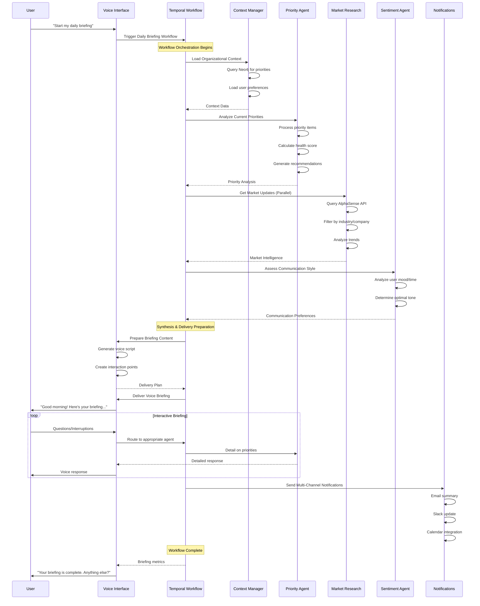
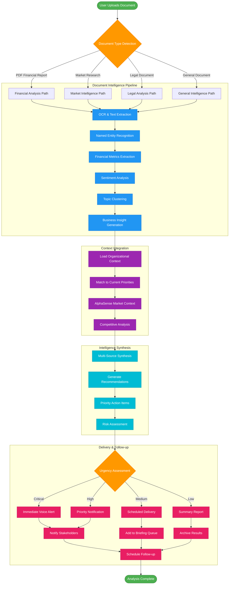
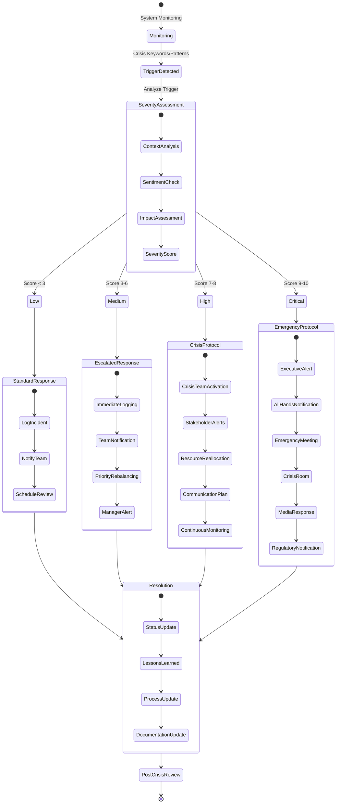
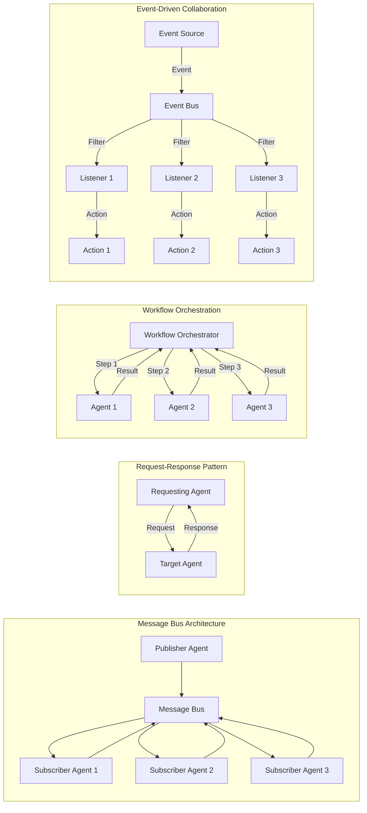
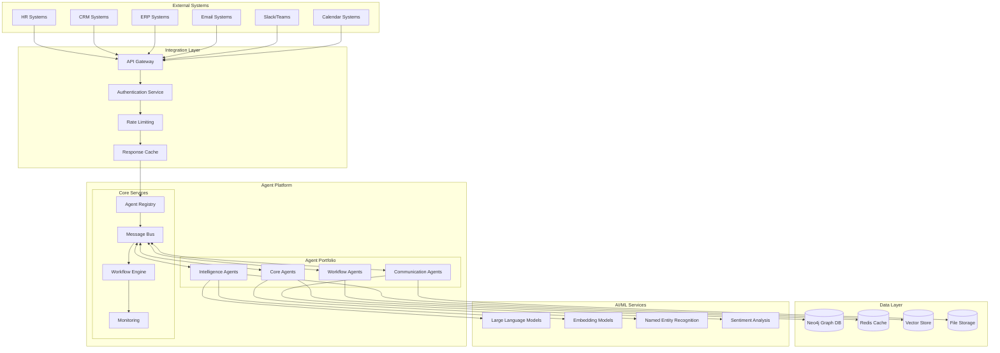
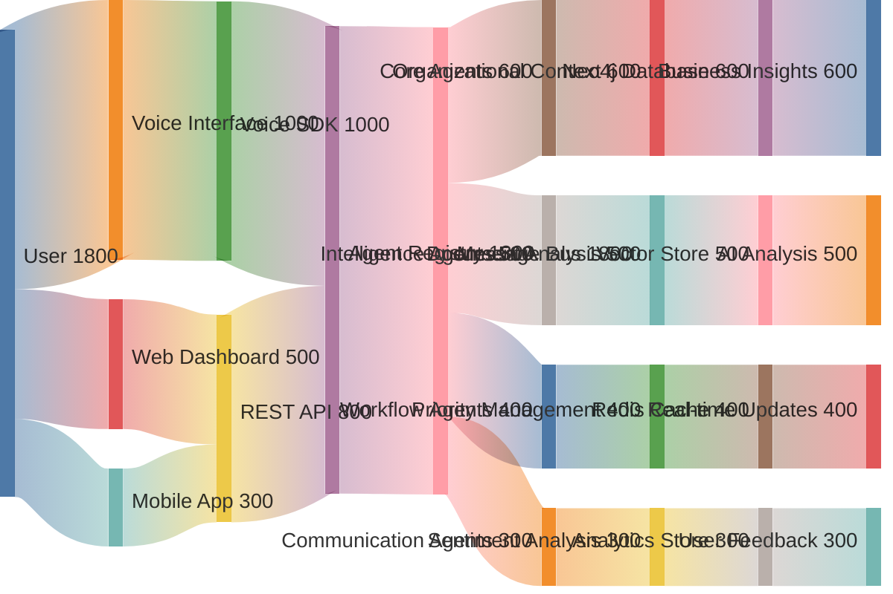
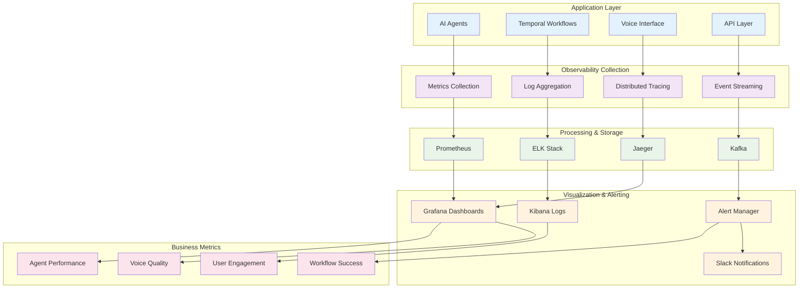

# 🏗️ System Architecture Diagrams

## 📋 Overview

This document provides visual representations of the AI Agent Portfolio system architecture, showing how all components work together to deliver enterprise-grade business intelligence through voice interaction.

## 🎯 Diagram 1: System Overview Architecture

```mermaid
graph TB
    subgraph "User Interface Layer"
        VUI[Voice User Interface]
        WEB[Web Dashboard]
        MOB[Mobile App]
        API[REST/GraphQL API]
    end

    subgraph "Voice SDK Layer"
        VSP[Voice SDK Provider Factory]
        OAI[OpenAI Realtime Provider]
        BSP[Browser Speech Provider]
        HYB[Hybrid Provider]
    end

    subgraph "Agent Orchestration Layer"
        TMP[Temporal Workflows]
        REG[Agent Registry]
        MSG[Message Bus]
        WFE[Workflow Engine]
    end

    subgraph "AI Agent Portfolio"
        subgraph "Core Agents"
            VIA[Voice Interface Agent]
            CTX[Context Manager Agent]
            ANA[Analytics Coordinator]
        end

        subgraph "Intelligence Agents"
            DOC[Document Intelligence]
            MKT[Market Research]
            FIN[Financial Intelligence]
            SYN[Research Synthesis]
        end

        subgraph "Workflow Agents"
            PRI[Priority Management]
            CRI[Crisis Response]
            BRI[Daily Briefing]
            DEC[Decision Support]
        end

        subgraph "Communication Agents"
            SEN[Sentiment Analysis]
            CON[Conversation Flow]
            INT[Interruption Handler]
            MUL[Multi-Modal]
        end
    end

    subgraph "External Integrations"
        ALP[AlphaSense API]
        OPE[OpenAI API]
        ORG[Organizational Data]
        NOT[Notification Services]
    end

    subgraph "Infrastructure Layer"
        RED[Redis Cache]
        NEO[Neo4j Database]
        MON[Monitoring & Logs]
        SEC[Security Layer]
    end

    %% User Interface Connections
    VUI --> VSP
    WEB --> API
    MOB --> API
    API --> REG

    %% Voice SDK Connections
    VSP --> OAI
    VSP --> BSP
    VSP --> HYB
    VSP --> VIA

    %% Orchestration Connections
    TMP --> REG
    REG --> MSG
    MSG --> WFE
    WFE --> VIA
    WFE --> CTX
    WFE --> ANA

    %% Agent Connections
    VIA --> DOC
    VIA --> PRI
    VIA --> SEN
    CTX --> ORG
    DOC --> ALP
    MKT --> ALP
    PRI --> CTX
    BRI --> PRI
    BRI --> MKT
    BRI --> VIA

    %% Infrastructure Connections
    REG --> RED
    CTX --> NEO
    DOC --> NEO
    ANA --> MON
    API --> SEC

    %% External Connections
    NOT --> VUI
    NOT --> WEB
    NOT --> MOB

    %% Styling
    classDef userLayer fill:#e1f5fe
    classDef voiceLayer fill:#f3e5f5
    classDef orchestrationLayer fill:#e8f5e8
    classDef coreAgents fill:#fff3e0
    classDef intelligenceAgents fill:#e0f2f1
    classDef workflowAgents fill:#fce4ec
    classDef commAgents fill:#f1f8e9
    classDef externalLayer fill:#fff8e1
    classDef infraLayer fill:#fafafa

    class VUI,WEB,MOB,API userLayer
    class VSP,OAI,BSP,HYB voiceLayer
    class TMP,REG,MSG,WFE orchestrationLayer
    class VIA,CTX,ANA coreAgents
    class DOC,MKT,FIN,SYN intelligenceAgents
    class PRI,CRI,BRI,DEC workflowAgents
    class SEN,CON,INT,MUL commAgents
    class ALP,OPE,ORG,NOT externalLayer
    class RED,NEO,MON,SEC infraLayer
```

## 🔄 Diagram 2: Daily Briefing Workflow Flow

## 📄 Diagram 3: Document Analysis Flow (AlphaSense-style)

## 🚨 Diagram 4: Crisis Response Flow

## 🔄 Diagram 5: Agent Communication Patterns

## 🏢 Diagram 6: Enterprise Integration Architecture

## 🌊 Diagram 7: Data Flow Architecture

## 📊 Diagram 8: System Monitoring & Observability

## 🔧 Implementation Notes

### **Diagram Usage:**
1. **System Overview** - Use for stakeholder presentations and technical onboarding
2. **Daily Briefing Flow** - Use for explaining workflow orchestration to business users
3. **Document Analysis** - Use for demonstrating AlphaSense-style intelligence capabilities
4. **Crisis Response** - Use for business continuity and risk management discussions
5. **Agent Communication** - Use for technical architecture reviews
6. **Enterprise Integration** - Use for IT and compliance discussions
7. **Data Flow** - Use for performance and scalability planning
8. **Monitoring** - Use for operations and SRE teams

### **Technical Implementation:**
- All diagrams are **Mermaid-compatible** for easy integration into documentation
- **PlantUML alternatives** available for enterprise documentation systems
- **Interactive versions** can be created using tools like Draw.io or Lucidchart
- **Real-time dashboards** can implement the monitoring architecture shown

### **Customization:**
- Adjust colors and styling for corporate branding
- Add/remove components based on implementation phases
- Scale complexity up/down for different audiences
- Include security layers and compliance checkpoints as needed

These diagrams provide comprehensive visual documentation of your AI agent portfolio system, from high-level architecture to detailed operational flows. Perfect for presentations, technical reviews, and system documentation! 📊✨
