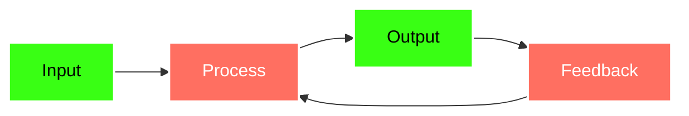
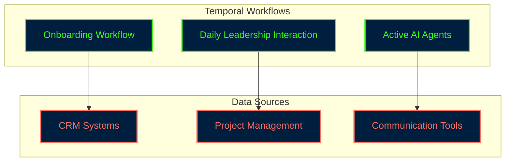

# Mermaid Diagrams for Antifragile Strategy Presentation

## Lost in Translation Problem

```mermaid
flowchart TD
    A[CEO Goal: "Focus on closing Q3 deals"] -->|Message| B[Sales Team]
    A -->|Message| C[Engineering Team]

    B --> D[Interprets: Prioritize renewals & existing customers]
    C --> E[Interprets: Delay or adjust new product roadmap]

    style A fill:#004488,stroke:#fff,stroke-width:2px,color:#fff
    style B fill:#88ccee,stroke:#333
    style C fill:#88ccee,stroke:#333
    style D fill:#ffeeaa,stroke:#333
    style E fill:#ffeeaa,stroke:#333
```

## Antifragile Strategy Flow



## Workflow Architecture


